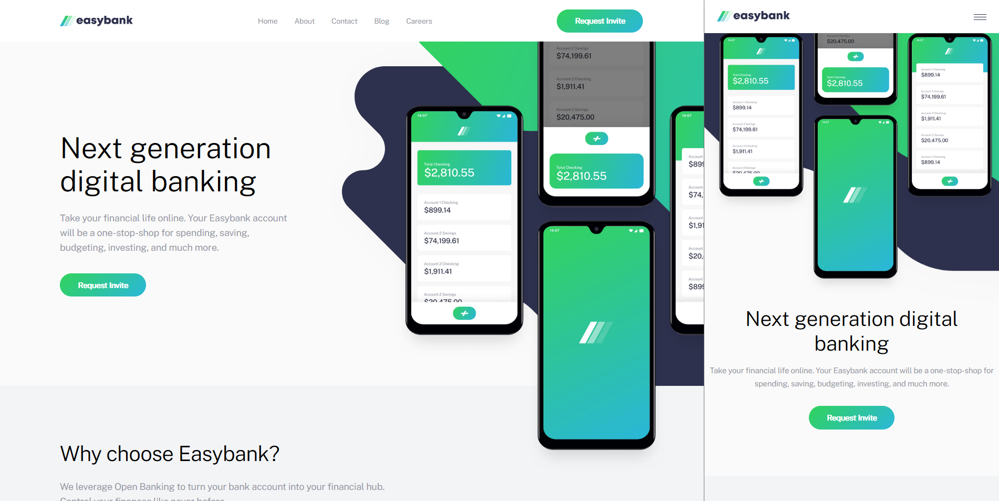

# Banking App Landing Page

This is a landing page for a banking app created using Sass, conforming to BEM-style conventions

### Screenshot

### Links

- Live Site URL: [banking.raynaldm.com](https://banking.raynaldm.com)

## My process

### Built with

- CSS
  + [Sass](https://sass-lang.com/) - CSS extension language
  + [BEM](https://en.bem.info/methodology/naming-convention/) - CSS naming conventions
  + Animations
  + Mobile-first workflow
  + Flexbox & CSS Grid
- JavaScript
- Semantic HTML5 markup

### What I learned

This was my first project working with CSS animations. It brought up some interesting challenges about how to separate concerns when it comes to integrating javascript.

For example, when it came to triggering the mobile menu animations, I decided to create a duplicate css class with an alternate naming scheme.

So for the buttons, to the `<a class="header__nav-close...">`, I added a `jsHeader__navClose` class. Then, when referring to the element in javascript, I exclusively used `jsHeader__navClose`.

In theory, even if the style-specific css classes change, the `js` namespace helps distinguish the class as tied to javascript.

If I were to improve on this, I would experiment with changing these classes to empty `--data-` attributes instead, to further distinguish the names as script-related.

## Author

- Website - [raynaldmirville.com](https://raynaldmirville.com)
- Twitter - [@rainalldaylong](https://www.twitter.com/rainalldaylong)
- Upwork - [Frontend web development services](https://www.upwork.com/freelancers/~011fc51cc0b76140cf)

## Acknowledgments

Many thanks go to [@meg_gutshall](https://twitter.com/meg_gutshall) for helping me debug menu animations.
